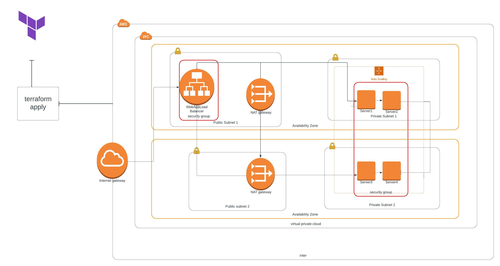

# Infrastructure Provisioning As Code Using Terraform

This project deploys an Apache web server for a highly available web application using [Terraform](https://www.terraform.io/). Terraform is an open-source infrastructure as code software tool that enables you to safely and predictably create, change, and improve infrastructure.

The infrastructure diagram was made using a diagrammimg application [Lucidchart](https://www.lucidchart.com/pages/), which displays all the resources needed to be deployed and provisioned by cloudformation.

## Brief Description Of files in the Repository

- **main.tf**

This file contains [resources](https://registry.terraform.io/providers/hashicorp/aws/latest/docs/resources) needed to be provisioned to deploy the apache web server up and running, the code is written in json format

  The resources provisioned as code includes; 
    - VPC
    - InternetGateway
    - IAM roles, policy and profile
    - Subnets
    - Route and Route tables
    - Security Groups
    - Launch Configuration
    - Load Balancers
    - AutoScaling Group

- **terraform.tfvars**

A "terraform.tfvars" file is an alternative to using the "-var" flag or environment variables. The file defines the variable values used by the script. If the file is named "terraform.tvars" it is loaded by default. Note that this follows a naming convention, that is it cannot be saved as "tf.tfvars"

- **variable.tf**
This file contains the variables defined to be used, to prevent "hardcoding" in the `main.tf`. It can be set as default, otherwise the values are passed into the `terraform.tfvar` file

- **output.tf**

This file outputs the DNS of the load balancer where the application can be found running from a Web Browser

### Prerequisites

The following tools should be installed and working.

- [awscli](https://aws.amazon.com/cli/)
- Create an account on [AWS](https://aws.amazon.com/)
- [Configure the awscli with an AdministratorAccess Policy](https://docs.aws.amazon.com/cli/latest/userguide/cli-chap-configure.html)
- [Download and Install terraform](https://www.terraform.io/downloads)

### Deploying the Resources

Run the following command on the local machine configured with aws cli

Creating Resources

 > `terraform init`
 
 > `terraform plan`

 > `terraform apply`

 Deleting Resources

  > `terraform delete`

  > `terraform destroy -target=resource.name` incase you are interested in deleting a particular resource.

 A successful deployment should output the resources created on the CLI

 #### Check that Apache Webserver is Up and Running.

Apache Webserver communicates using port 80 as created in the Security group of `main.tf`, to check that the server is running, copy the `load_balancer_DNS` outputed on the CLI

Open the browser and type http://[load_balancer_DNS]

##### Additional Info

**Note** The project was built for an Instagram Clone called Udagram.

We can deploy a static website located in a S3 bucket into the Apache Server from the EC2 Instances provisioned, this changes can be made in the `user_data` of `aws_launch_configuration`
The neccessary IAM roles, policy and profiles  needed should be well included, in this project a role, bucket policy and a profile was provisioned in the `main.tf`